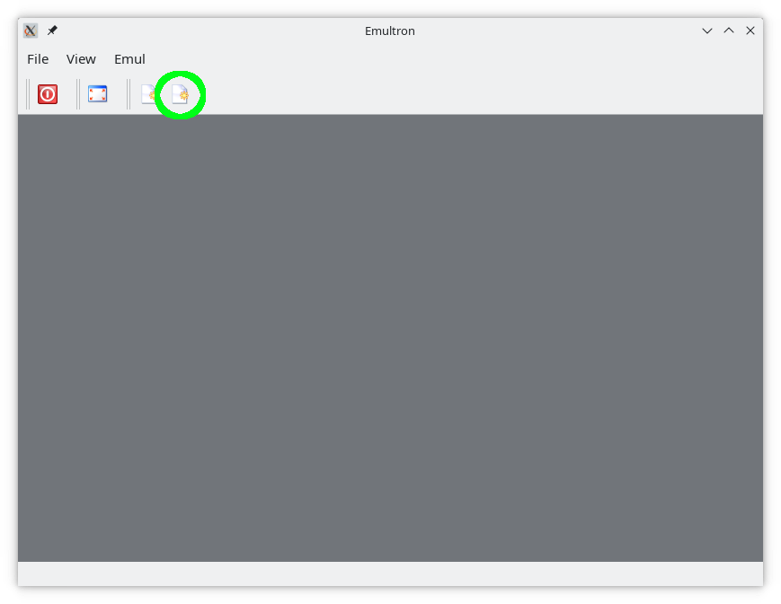
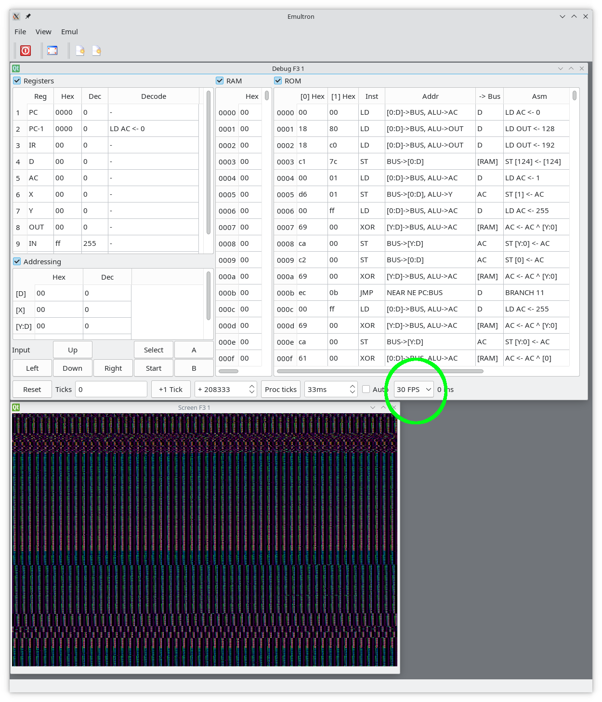
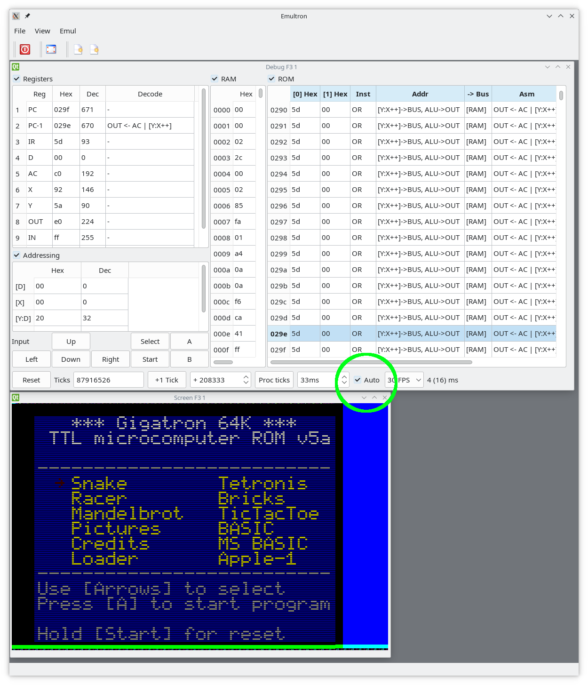

# Please download Gigatron images

Please download Gigatron images from https://github.com/kervinck/gigatron-rom

Please rename image file to ROM.rom

Please copy image file to ./data/ROM.rom

# Please compile & run

```
cmake -S . -B build
cmake --build build
./build/Emultron
```

Please click New Emulation icon 



Please select desired FPS



Please activate automatic mode


